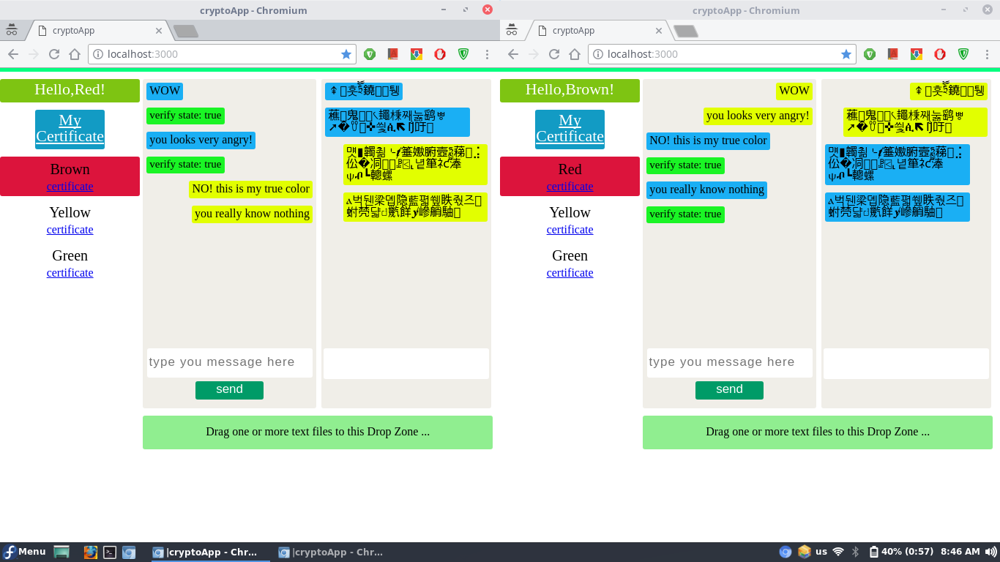

# يَسْتَخْفُونَ مِنَ النَّاسِ وَلَا يَسْتَخْفُونَ مِنَ اللَّهِ وَهُوَ مَعَهُمْ إِذْ يُبَيِّتُونَ مَا لَا يَرْضَىٰ مِنَ الْقَوْلِ ۚ وَكَانَ اللَّهُ بِمَا يَعْمَلُونَ مُحِيطًا

# cryptoApp
Private chat app that use Web-Crypto-API in Browser


# what we use:

<a href="https://www.w3.org/TR/WebCryptoAPI/">Web-Crypto-API</a>

    The Web Crypto API is an interface allowing a script to use cryptographic
    primitives in order to build systems using cryptography.

    A fundamental feature of this API is to allow the manipulation and storage of
    private and secret keys without requiring the underlying bits of the key to be
    made available to JavaScript.


<a href="http://pkijs.org/">PKI.js</a>
    
    PKIjs is a pure JavaScript library implementing the formats that are used in PKI applications
    (signing, encryption, certificate requests, OCSP and TSP requests/responses). It is
    built on WebCrypto (Web Cryptography API) and requires no plug-ins.

<a href="http://asn1js.org/">ASN1.js</a>
  
    Abstract Syntax Notation One (ASN.1) is a standard and notation that describes 
    rules and structures for representing, encoding, transmitting, and decoding data in
    telecommunications and computer networking. ASN1.js is a pure JavaScript library
    implementing this standard. ASN.1 is the basis of all X.509 related data
    structures and numerous other protocols used on the web.

<a href="https://github.com/lalosh/simpler-web-crypto-api">simpler-web-crypto-api</a>

    use Web Crypto API,PKI.js,ASN1.js to make simpler API for the browser


# Stages

This app has been built in four stages:

## 1-Symmetric Encryption

    Overview:    
    use the secret key to encrypt a message before send and use it again to decrypt a message 
    when received
         
    Use web-crypto-api to generate one secret key per user and use it to encrypt each message
    the user has typed in showing the result as soon as the user hit the send button.
    
    Info:
    Alogorithm used: AES-CBC
    key length: 128 bit
    
    input: the message(as an array buffer)
    output: the encrypted message(cipher text) + Initialization vector(iv)

    Why AES use the iv?
    First AES initialize iv with random values for each encryption process and use this iv with
    the message to get the cipher text.
    then you have to attach the iv with each encrypted message to decrypt it later on.
   
    How do you know iv is really fully random and protectful?
    if you send two identical messages you will have two totally different cipher text
    which make it really hard even for `Crypto Analysis` to deduce what has been send
    and received between you and the one who are you talking with.


## 2-Asymmetric Encryption
    
    Overview:
    use the public key of a receiver to encrypt the specific message sent to him/her 
    and then on the receiver browser window use his/her own private key to decrypt the message

    Use web-crypto-api to genereate one key pair(public key + private key) per user thus
    the public key is sent to the server and everyone online and the private key is kept
    inside the user browser.

    Info:
    Algorithm used: RSA-OAEP
    Modulus Length: 2048
    Public Exponent: 65537
    hash: SHA-256
    

## 3-Digital Signature

    Overview:
    use the private key of a sender to sign the message sent and use the public key of the
    sender on the receiver browser window to verify the message is kept save(message integrity)
    and it was really sent from him/her(Non-repudiation)

    Use web-crypto-api to genereate one key pair(public key + private key) per user thus the
    public key is sent to the server and everyone online and the private key is kept inside
    the user browser.
    
    Info:
    Algorithm used: RSASSA-PKCS1-v1_5
    Modulus Length: 2048
    Public Exponent: 65537
    hash: SHA-256
    
## 4-Digital Certificate

    Overview:
    Validity is an important for public keys transfered over the network and information
    concerning each public key is a crucial goal and so we create a certificate
    (similar to each person ID card) which include each user Common Name,Orgainzation
    and Country Code and we make it availabe for one complete month starting at the time
    the certificate was genereated in.

    While it's still an app for testing and learning we used self-certificate which means
    each user create his own certificate(which should have been on the server not the client's browser)
    which include all the information that a certificate need with the public key included ofcourse
    and he/she sign it with his/her private key then sent it to the server and anyone connected.

    Info:
    Certificate format: X.509
    Libraries used: PKI.js, ASN1.js


## To Run it:

```sh
#download it
git clone https://github.com/lalosh/cryptoApp.git

#.then
#cd into the cryptoApp folder 
cd cryptoApp

#.then type
npm install

#.then
npm start
```

## screenshots





# والحمد للّه ربّ العالمين